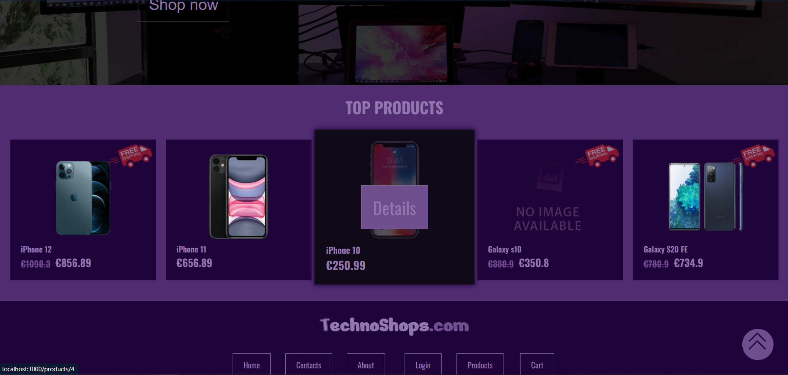
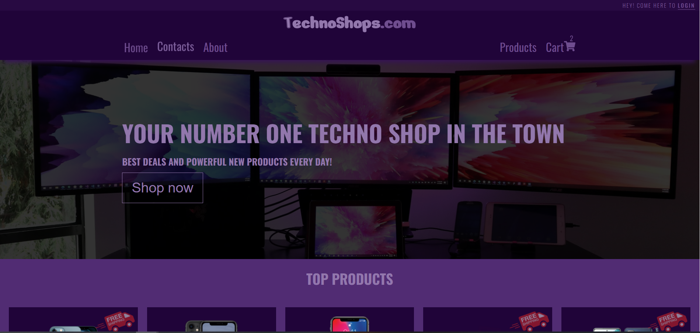
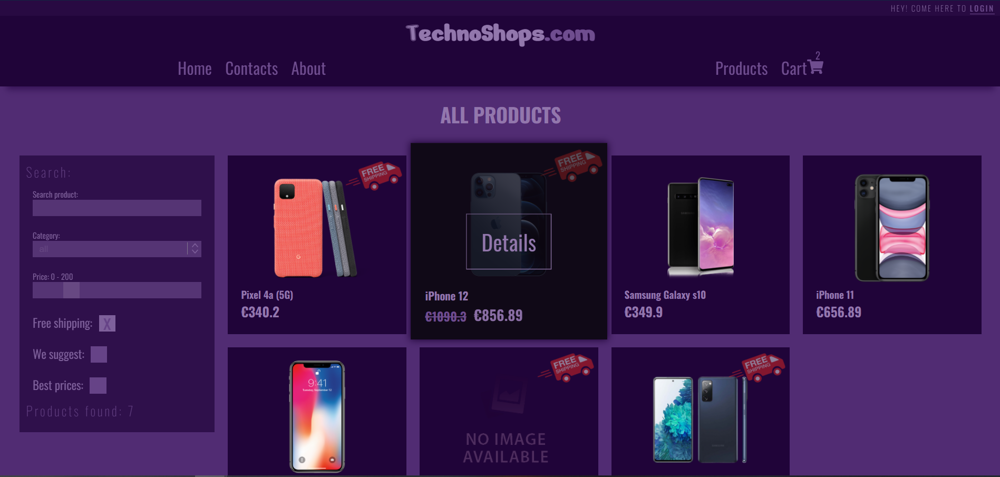
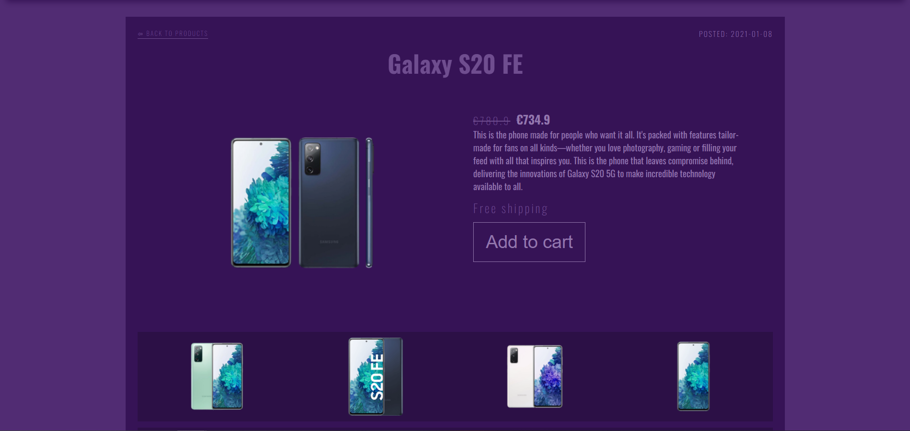
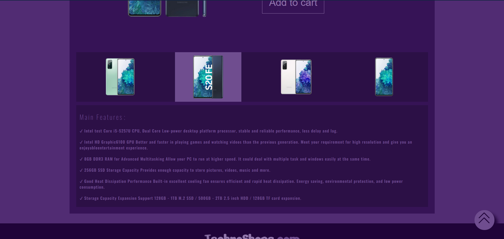
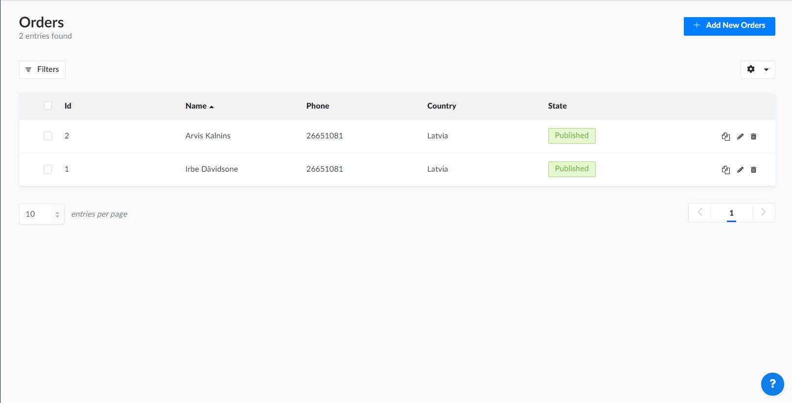

<h1>TehnoShop.com Fully functional online shop made with React.</h1>

TehnoShop.com is a fully functional online store built with React for the front end and Strapi API for the back end. It features user registration and login, product selection, and Stripe for payment processing. React, a JavaScript library for building UI components is developed by Facebook and the developer community. Strapi is an open-source Headless CMS that enables flexible content management and distribution. Stripe supports online business payments for companies of all sizes. The site uses advanced CSS and JavaScript for dynamic effects and responsiveness, hosted on Netlify and Heroku. Git is utilized for version control. Note: The backend may initially load slowly due to free hosting limitations.

<h5>Check demo:  <a href="https://tehno-shop-react.netlify.app/" target="_blank">Demo</a>  </h5>
 

